## Введение
 Автоматизация проверок основного функционала шины через API
## Технологии и инструменты

* ЯП - [Java](https://go.java/) 
* Сборщик - [Gradle](https://gradle.org)
* Тестовый фреймворк - [JUnit 5](https://junit.org/junit5/)
* Фреймворк для работы с API - [REST-Assured](https://rest-assured.io)
* Отчетность - [Allure Report](http://allure.qatools.ru), [Telegram Bot](https://core.telegram.org/bots)
* Запуск - локально clone репозиторий / Jenkins

## Предварительная настройка среды
1. Установка JDK (Java SE Development Kit);
- проверить наличие Java и версию через консоль, с помощью команды `java -version`.Если в консоли выводится `java version "11.0.13"`, значит установлена верная версия Java.
- в противном случае рекомендуется поставить 11 версию Java, для этого скачать OpenJDK [по ссылке](https://download.java.net/java/GA/jdk11/9/GPL/openjdk-11.0.2_windows-x64_bin.zip)
- распаковать скаченный архив, и прописать путь до папки в переменные среды ([подробнее](https://github.com/qa-guru/getting-started-java/wiki/1.-%D0%A3%D1%81%D1%82%D0%B0%D0%BD%D0%BE%D0%B2%D0%BA%D0%B0-JDK))
2. Установка Gradle;
- перейти [по ссылке](https://gradle.org/releases/)
- На странице найти раздел v7.4.x;
- Скачать Binary-only.
- На диске C:\ создать директорию «Gradle», распаковать в неё содержимое папки gradle-7.4.x архива
- прописать переменные среды ([подробнее](https://github.com/qa-guru/getting-started-java/wiki/2.-%D0%A3%D1%81%D1%82%D0%B0%D0%BD%D0%BE%D0%B2%D0%BA%D0%B0-Gradle))
3. Установка Git;
- перейти [по ссылке](https://git-scm.com/downloads)
- выбрать ОС и далее выполнить установку по инструкции
4. Установка IDEA;
- нам достаточно Community Edition, переходим [по ссылке](https://www.jetbrains.com/ru-ru/idea/download/#section=windows) и скачиваем
- после скачивания, запускаем установщик
- во время установки, необходимо поставить галочку в пункте `Update PATH variable`
- более подробно [по ссылке](https://github.com/qa-guru/getting-started-java/wiki/4.-%D0%A3%D1%81%D1%82%D0%B0%D0%BD%D0%BE%D0%B2%D0%BA%D0%B0-IntelliJ-IDEA)
5. Клонирование проекта из GitHub
- перейти на страницу проекта https://github.com/berlioz458/automationtestsaxpl (Если нет доступа обратиться к Шулининой Е.)
- нажать зелёную кнопку `Code`, в открывшемся модальном окне скопировать строчку с адресом репозитория
- запустить IntelliJ IDEA
- в IDEA выбрать `File -> New -> Project from Version Control...`
- в появившемся окне вставить URL репозитория
- нажать синюю кнопку `Clone` в правом нижнем углу окна
- в появившемся окне нажать синюю кнопку `Trust Project`
- выбрать `File -> Settings`, в окне поиска ввести `gradle`, в открывшемся пункте настроек выставить значения как на скриншоте
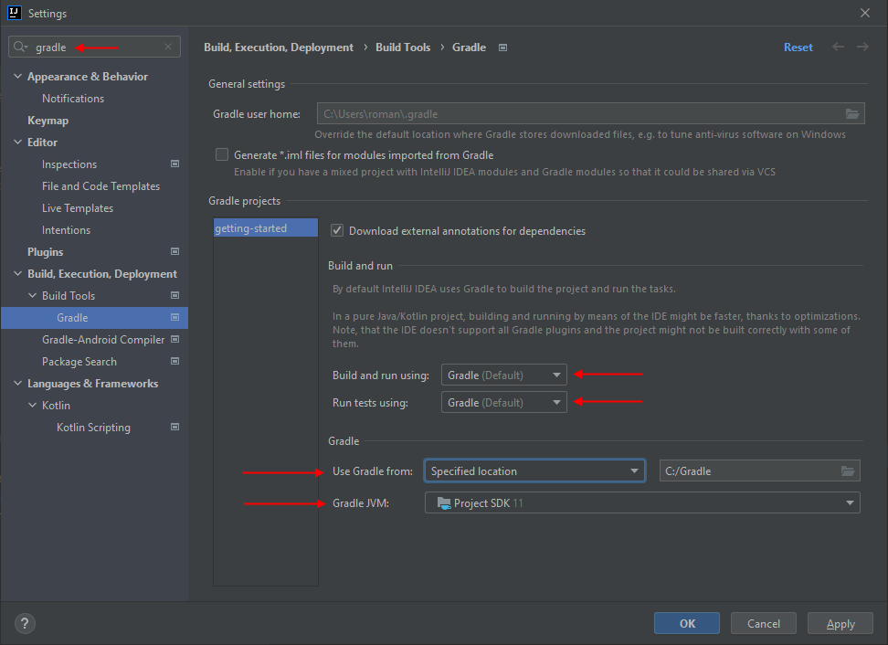
- нажать кнопку `OK`, подождать пока настройки Gradle обновятся
- перейти в раздел `Gradle`

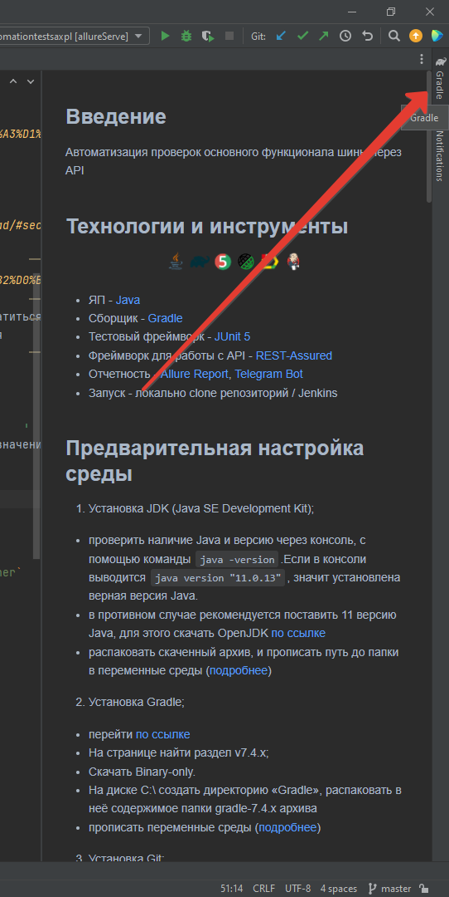

- перейти в настройки автоматической подгрузки изменений

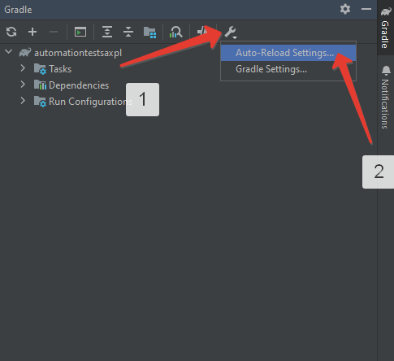

- проставить настройки как на скриншоте, это позволит не подгружать зависимости каждый раз при внесении изменений в скрипт сборки

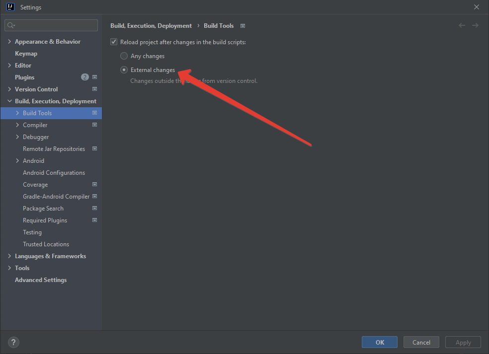

## Запуск тестов
Для удобства запуска, тесты отмечены тегами, на теги в свою очередь заведены Task.
Найти их и запустить можно как в файле `build.gradle`, так и в IDEA справа в блоке Gradle, раздел `other`

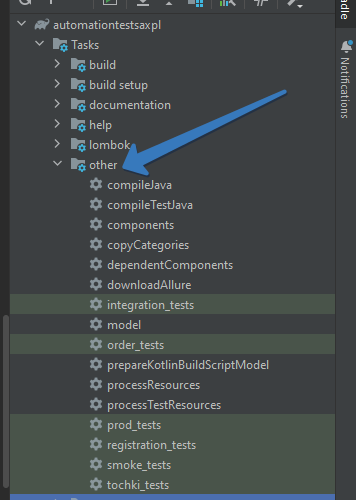

Полный список на текущий момент для bus: 
* integration_tests
* order_tests
* registration_tests
* smoke_tests
* дополняется...

Так же есть возможность запустить тесты для отдельного класса или только один тест.

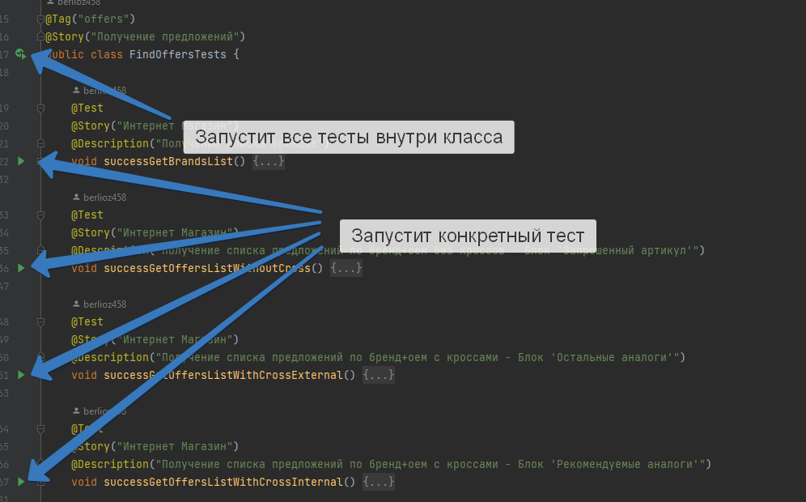

## Реализованные возможности
На данный момент реализованы следующие сценарии: 
- Регистрация клиента(получение deviceToken, регистрация, верификация) `Registration Manager`
- Авторизация клиента(получение authToken, возможность самоудаление профиля) `Registration Manager`
- Поиск предложений (/findOffers - запросы, которые выполняются ИМ и МП для получения предложений) `Offer Service`
- Получение способов доставки (/rates) `Delivery Service`
- Оформление заказа (самозаказ/делегированный) `Order Service`
- Создание объектов для работы партнеров и клиентов: Шаблон договора, Платежный счет, Документы, Программа лояльности, Маркетинговые акции `Order Service`
- Инициировать оплату заказа (получение URI на оплату через СБП, через Sber) `Payment Gataway`

## Результаты выполнения тестов
Для анализа, используются возможности фреймворка `Allure`, который позволяет нам в удобочитаемом формате посмотреть и оценить результаты работы наших тестов.

После выполенения тестов, рекомендуется запустить задачу из раздела `verification` - `allureServe`(Важно: Если запуск осуществляется впервые, потребуется сначала запуск `allureReport` для скачивания нужных для фреймворка библиотек).

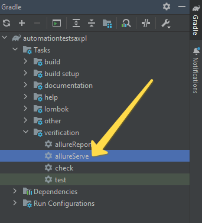

Если всё выполнено верно, в результате работы Task-и, мы получим адрес где можем посмотреть сфомированный отчёт
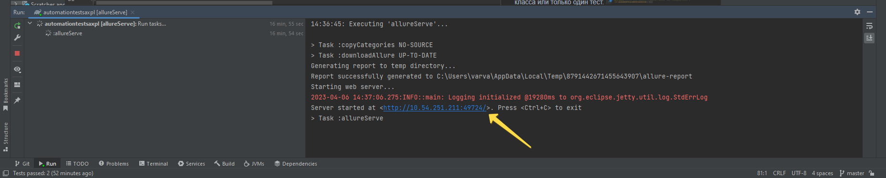

В отчете отображается вся информация о прогоне:
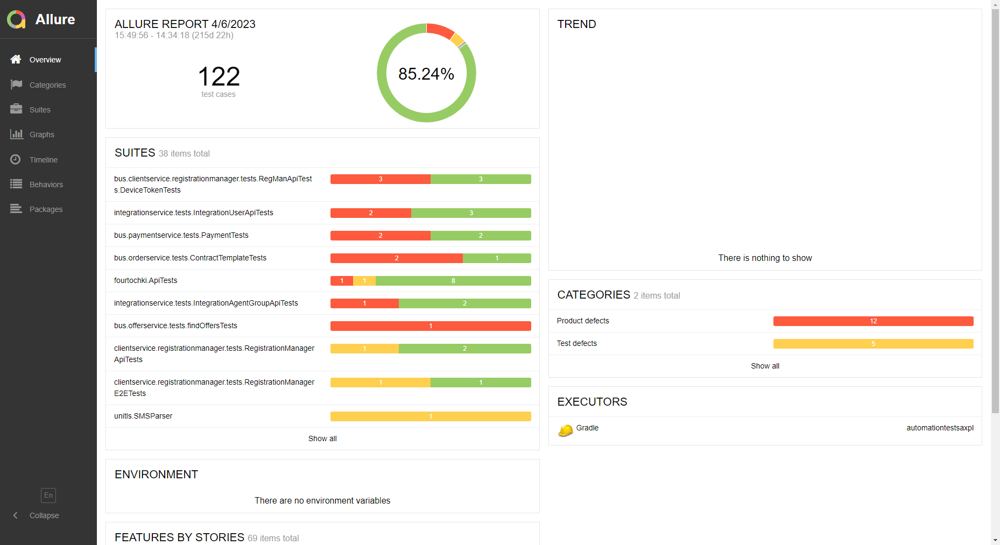

Так как в тестах используются аллюровские аннотации `@Story` и `@Epic` видеть сгруппированные сценарии и результаты их выполнения
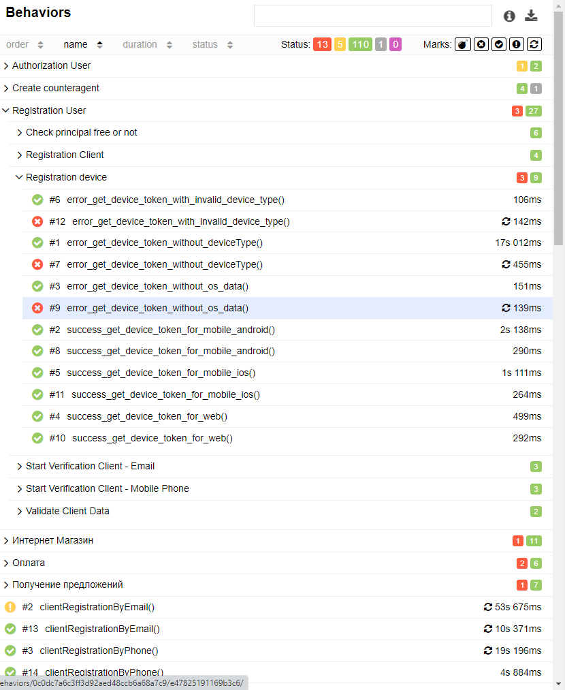
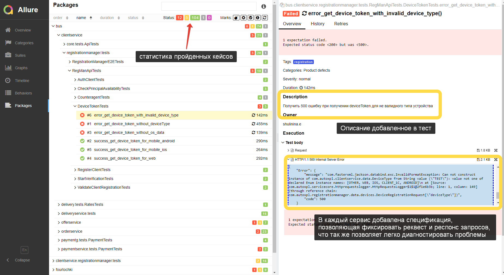

## Другие особенности реализации
* На курсе QA GURU так же получены знания о работе с Jenkins.
Локально поднят был свой, сконфигурирована Job-а на запуск. 

* При выполнении через CI/CD так же можно сконфигурировать оповещения в заранее созданный Telegram-канал, где по результатам работы будут приходить оповещения.

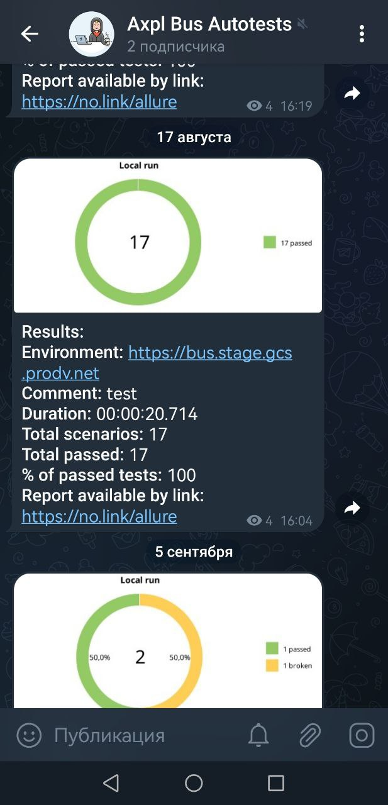

